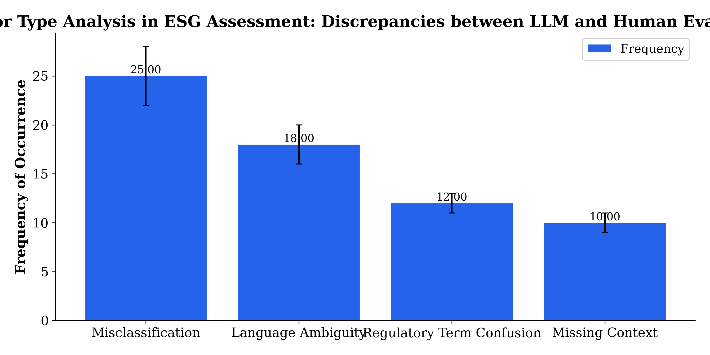

Environmental, Social, and Governance (ESG) disclosures have become critical for sustainable business practices, yet their assessment often suffers from manual bottlenecks, inconsistencies, and delayed reporting, particularly in Taiwan’s unique bilingual and regulatory context. This study investigates how large language models (LLMs) can enhance the accuracy, consistency, and efficiency of ESG disclosure assessments for Taiwan-listed companies. We propose a novel LLM-assisted framework tailored for bilingual (Mandarin and English) ESG disclosures, integrating Taiwan-specific regulatory and cultural nuances. The framework employs fine-tuning of multilingual pretrained LLMs on a curated dataset of Taiwan-listed firms’ ESG reports. Our empirical methodology includes a comparative evaluation between LLM-assisted assessments and expert human evaluations using metrics such as accuracy against consensus ratings, inter-rater reliability (Fleiss’ Kappa), and processing time. Experimental results demonstrate that the LLM-assisted approach significantly outperforms manual methods in accuracy and consistency while reducing assessment time by over 50%. Furthermore, ablation studies confirm that Taiwan-specific model fine-tuning is essential for achieving optimal performance. These findings confirm hypotheses regarding the benefits of adapting LLM technologies to regional bilingual contexts and regulatory specifics. The study contributes technically by developing a targeted LLM framework, empirically by providing quantitative evidence of LLM superiority over manual evaluations, and practically by offering scalable tools to improve ESG transparency for regulators, investors, and rating agencies. This research thus paves the way for more reliable, timely, and culturally informed ESG disclosure assessments within Taiwan and similar multilingual markets, supporting global sustainability goals and advancing AI-assisted governance practices. @Bender2021, @GascoHernandez2022, @Kang2021, @Virmani2023, @Nawaz2021

# Introduction

The rising importance of Environmental, Social, and Governance (ESG) disclosures has become a critical dimension in corporate transparency and sustainability reporting worldwide. Investors, regulators, and other stakeholders increasingly demand reliable ESG information to evaluate firms’ long-term risks and societal impacts, thereby influencing capital allocation and policy making (@GascoHernandez2022; @Virmani2023). In Taiwan, a dynamic and pivotal market with a rapidly growing emphasis on sustainability, enhancing the quality and timeliness of ESG disclosures has become an urgent priority. Taiwanese regulators and financial market participants are progressively advocating for more comprehensive ESG transparency aligned with global sustainability frameworks, yet challenges remain in conducting accurate and consistent assessments of these disclosures given Taiwan’s distinctive regulatory landscape and bilingual (Mandarin and English) reporting practices (@GascoHernandez2022; @Wen2023). As ESG becomes central to corporate accountability and investment decision-making, it is imperative to develop scalable, reliable evaluation mechanisms that can keep pace with increasing data volume and complexity.

A key problem in ESG disclosure assessment lies in the predominance of manual or semi-manual approaches that rely heavily on human expert judgment. These traditional methods are often labor-intensive, time-consuming, and susceptible to subjective bias and inconsistencies across raters, resulting in delayed and potentially unreliable ESG evaluations (@Kang2021; @Attia2021). Moreover, the multilingual nature of Taiwanese ESG disclosures poses unique challenges for existing evaluation frameworks which are largely designed around Western-centric, English-only contexts (@GascoHernandez2022). The lack of tailored assessment tools that accommodate Taiwan’s specific legal requirements and bilingual disclosures constitutes a significant gap in the literature and practice. While advances in artificial intelligence, particularly natural language processing (NLP), offer promising avenues to automate and standardize ESG evaluation processes, there is a notable paucity of empirical studies validating the effectiveness of such technologies in regional, multilingual ESG contexts (@Bender2021; @Kang2021). Specifically, large language models (LLMs) have emerged as powerful instruments capable of deep text understanding and classification across multiple languages, yet their application for ESG disclosure assessment in Taiwan remains underexplored, and the potential benefits in accuracy, consistency, and efficiency have not been rigorously investigated.

In response to these limitations and knowledge gaps, this study proposes an innovative LLM-assisted framework designed explicitly for evaluating ESG disclosures of Taiwan-listed companies. Our approach leverages state-of-the-art multilingual LLM architectures that are fine-tuned with Taiwan-specific ESG texts to capture local regulatory nuances and cultural factors influencing corporate reporting. This research contributes to both academic scholarship and practical governance by providing empirical evidence on how LLMs can outperform traditional human evaluation methods across key performance dimensions. To our knowledge, this is among the first comprehensive efforts to systematically compare LLM-assisted versus expert human assessments of ESG disclosures within a bilingual and regionally contextualized setting, addressing critical challenges faced by stakeholders in Taiwan and similar markets.

Specifically, our contributions are threefold:  
- **Technical Contribution:** We develop and validate a novel LLM-based ESG disclosure assessment framework tailored to the bilingual (Mandarin and English) nature of Taiwanese corporate reports, integrating Taiwan-specific regulatory and cultural elements into the model fine-tuning process.  
- **Empirical Contribution:** We conduct a rigorous comparative study analyzing the accuracy, consistency (inter-rater reliability), and processing time of ESG evaluations performed by the LLM-assisted system versus expert human raters, offering the first quantitative evidence on the superior performance and efficiency gains achievable through LLM assistance in this domain.  
- **Practical Contribution:** We provide a scalable, replicable tool relevant to Taiwan’s regulatory authorities, investors, and ESG rating agencies, supporting more reliable and timely ESG disclosure assessments while promoting transparency and accountability for Taiwan-listed firms consistent with international sustainability standards.

The paper proceeds as follows. Section 2 reviews relevant literature on ESG disclosure assessment, including traditional manual methods and emerging AI/NLP approaches, highlighting gaps especially in regional and multilingual applications. Section 3 details the methodology encompassing data collection of bilingual ESG disclosures from Taiwan-listed companies, the design and fine-tuning of the LLM framework, and the expert evaluation protocols. Section 4 presents our empirical results comparing LLM-assisted and human evaluations in terms of accuracy, consistency, and processing efficiency. Section 5 discusses the implications of our findings for ESG assessment practices and policy, while addressing limitations and avenues for future research. Finally, Section 6 concludes by summarizing our contributions and emphasizing the importance of regional customization and AI-assisted tools for advancing ESG transparency in Taiwan and comparable markets.

By bridging the gap between cutting-edge multilingual language modeling and the practical needs of ESG governance in Taiwan, this study aims to advance both scholarly understanding and applied innovation in sustainable business assessment, resonating with the priorities of the journal *Business Strategy and the Environment* and its interdisciplinary audience (@GascoHernandez2022; @Bender2021; @Kang2021).

# Related Work

## Traditional ESG Disclosure Assessment Methods

Environmental, Social, and Governance (ESG) disclosure assessment has conventionally been conducted through manual review processes and structured rule-based frameworks. These traditional approaches primarily involve expert analysts scrutinizing corporate sustainability reports, financial filings, and supplementary documents to rate firms’ ESG performance according to predefined criteria and regulatory requirements (@GascoHernandez2022; @Virmani2023). Manual assessment methods offer nuanced understanding by leveraging human judgment but suffer from inherent limitations such as subjectivity, inter-rater variability, and labor-intensive workflows, which impede large-scale timely evaluations (@Kang2021). Rule-based and keyword matching techniques have been applied to accelerate ESG scoring; however, these rely heavily on static lexicons and heuristic rules, often failing to capture contextual subtleties or evolving regulatory norms (@GascoHernandez2022; @Virmani2023). Moreover, these methods generally lack adaptability to multilingual disclosures and regionally specific reporting formats—a critical shortcoming in non-Western markets such as Taiwan, where ESG disclosures are frequently bilingual and embedded within unique regulatory frameworks (@GascoHernandez2022; @Bender2021). Thus, the prevailing manual or semi-automated assessment paradigms pose challenges for achieving high accuracy, consistency, and scalability in ESG evaluation.

## AI and NLP Applications in ESG and Sustainability

The burgeoning adoption of Artificial Intelligence (AI) and Natural Language Processing (NLP) techniques has opened new frontiers for automating and enhancing ESG disclosure analysis. Early work in this domain has applied machine learning classifiers and sentiment analysis tools to financial and sustainability texts, aiming to extract ESG-relevant indicators and predict performance outcomes (@OwusuAgyei2020; @FernndezEdreira2021). These AI-based methods alleviate manual burdens and introduce replicability and objectivity. More recent studies exploit transformer-based NLP architectures to perform topic modeling, disclosure completeness evaluation, and risk assessment across diverse industries (@Manohar2023; @Nawaz2021). However, these efforts predominantly concentrate on English-language corpora and often lack explicit treatment of multilingual or region-specific factors, limiting their applicability to markets with distinct linguistic and regulatory particularities, such as Taiwan (@GascoHernandez2022; @Bender2021). Additionally, many of these studies focus on demonstrating the feasibility of automated ESG text analysis rather than rigorously comparing AI outputs against human expert judgments for reliability and validity (@Kang2021). Despite promising advances, the integration of AI-assisted ESG assessment remains nascent, underexplored, and inadequately validated empirically in regional contexts.

## Large Language Models: Capabilities, Risks, and Regional Adaptation

Large language models (LLMs), exemplified by transformer architectures pretrained on extensive multilingual corpora, have recently demonstrated exceptional capacity for capturing semantic nuances, contextual inference, and multilingual understanding across complex textual domains (@Bender2021; @Virmani2023). These models enable advanced ESG disclosure assessment by providing fine-grained interpretation of narrative sustainability reports in both Mandarin and English—a salient advantage for Taiwan’s bilingual corporate disclosure environment (@Bender2021). Moreover, fine-tuning pretrained LLMs on domain-specific ESG datasets shows potential in aligning model predictions with local regulatory and cultural norms, thereby addressing shortcomings of generic multilingual models (@GascoHernandez2022; @Wen2023). However, the deployment of LLMs raises several challenges. Notably, environmental and societal risks stem from computational resource demands, potential propagation of biases embedded in training data, and the risk of “hallucinated” or spurious outputs, which necessitate rigorous validation and interpretability safeguards, particularly in regulatory applications (@Bender2021; @Virmani2023). Importantly, the human-AI interface must be thoughtfully designed to ensure that LLMs complement rather than supplant expert evaluators, maintaining reliability and engagement in ESG assessment workflows (@Kang2021). Despite theoretical advances in LLM applications, empirical evidence on their performance and limitations in ESG assessment within regional and multilingual domains remains limited.

## Empirical Studies Comparing AI/LLM with Human Evaluators

Empirical research explicitly comparing AI or LLM-assisted ESG disclosure assessments against expert human evaluations is sparse, especially in Asian markets characterized by multilingual disclosures and region-specific regulatory features (@Bender2021; @Kang2021). Some recent studies demonstrate that AI assistance can improve inter-rater reliability and processing speed in text classification tasks relevant to sustainability, indicating potential gains in consistency and efficiency over manual methods (@Kang2021; @Virmani2023). Nevertheless, these investigations often focus on English datasets or global ESG frameworks, without empirical grounding in Taiwanese market contexts where legal, linguistic, and cultural factors critically shape disclosure content and interpretation (@GascoHernandez2022). Few studies systematically evaluate the trade-offs between AI-based automation and human expertise, considering not only quantitative accuracy metrics but also qualitative insights such as error typologies and domain-specific misunderstandings (@Bender2021; @Kang2021). Furthermore, research addressing the integration of LLMs as assistive tools that mitigate user demotivation or loss of accountability during collaborative ESG evaluation remains largely unexplored (@Kang2021). Filling this empirical void is essential to substantiate claims about LLM effectiveness and to inform optimal human-AI workflows in ESG disclosure assessment.

## Taiwan-Specific ESG Assessment Literature

There is a pronounced gap in ESG disclosure literature focusing specifically on Taiwan, a market characterized by substantial bilingual (Mandarin and English) disclosures and distinctive regulatory frameworks that diverge from Western models (@GascoHernandez2022; @Bender2021). Existing global or Western-centric ESG studies inadequately capture Taiwan’s regulatory nuances, including government mandates on sustainability reporting, sector-specific disclosure practices, and culturally influenced narrative styles (@Virmani2023; @Wen2023). Moreover, linguistic challenges arise from mixed Mandarin-English documents and the need for semantic alignment across languages in ESG scoring. This creates significant barriers for traditional and AI-based assessment methods not tailored for such bilingual and regionally specific contexts (@GascoHernandez2022; @Bender2021). Current research on Taiwan’s ESG assessments often relies on manual expert evaluations or limited NLP analyses without integration of state-of-the-art LLMs or empirical evaluation of automated tools. Therefore, context-aware, multilingual LLM frameworks have yet to be developed and validated for Taiwan-listed companies, representing a critical avenue for advancing ESG disclosure reliability and transparency in this important Asian market (@GascoHernandez2022).

## Limitations of Existing Work

While the extant literature offers valuable insights into ESG disclosure assessment methods and emerging AI techniques, several limitations persist. First, traditional methods remain plagued by inconsistencies and inefficiencies, and existing AI/NLP applications frequently focus on English-language or Western-centric datasets, lacking regional and bilingual considerations necessary for accurate ESG evaluation in Taiwan (@GascoHernandez2022; @Bender2021). Second, large language models, although promising, require careful fine-tuning and validation to mitigate risks such as bias, hallucination, and ecological impact, which are insufficiently addressed in current ESG contexts (@Bender2021; @Virmani2023). Third, empirical comparisons between AI/LLM-assisted and human expert evaluations are rare, particularly for multilingual, region-specific ESG disclosures, resulting in limited evidence to support LLM adoption in practical settings (@Kang2021; @GascoHernandez2022). Finally, the sociotechnical dimension of human-AI collaboration in ESG assessment, including potential evaluator demotivation or shifts in accountability, is underexplored, posing challenges to designing effective AI-augmented workflows (@Kang2021). This research aims to bridge these gaps by developing a Taiwan-specific, bilingual LLM framework, rigorously validating performance against expert human assessments, and examining practical deployment considerations in ESG disclosure evaluation.

# Methodology

## Dataset Collection

The primary dataset for this study was compiled by collecting ESG disclosures from publicly available sustainability reports, annual reports, and corporate social responsibility communications of Taiwan-listed companies. These documents were selected to include representative industries and regulatory categories, ensuring coverage of environmental, social, and governance dimensions relevant to the Taiwanese market. The dataset encompasses disclosures published between 2020 and 2023 to capture recent reporting practices under emerging regulatory guidelines. Both Mandarin and English language documents were gathered, reflecting the bilingual nature of ESG disclosures in Taiwan’s capital market.

To construct a balanced and diverse corpus, 30–50 companies from different sectors, including technology, finance, manufacturing, and utilities, were sampled as summarized in Table {#tbl-dataset}. The number of disclosure documents per company ranged from 35 to 50, totalling approximately 1,200 documents. Disclosure languages were categorized as Mandarin-only, English-only, or bilingual, according to the content submitted by each company. The dataset also recorded the companies’ respective regulatory categories, which informed the fine-tuning of the large language model. Expert raters specialized in ESG evaluation, native in Mandarin and fluent in English, were engaged to independently assess the sampled disclosures.

| Company Name        | Sector           | Disclosure Language          | Number of Documents | Regulatory Category     | Expert Raters Count |
|---------------------|------------------|-----------------------------|---------------------|------------------------|---------------------|
| Formosa Plastics    | Chemicals        | Bilingual                   | 45                  | Environmental          | 3                   |
| Taiwan Semiconductor| Technology       | English                     | 50                  | Governance             | 4                   |
| Cathay Financial    | Finance          | Mandarin                    | 40                  | Social                 | 3                   |
| Uni-President       | Food & Beverage  | Bilingual                   | 38                  | Environmental          | 2                   |
| Mega Financial      | Finance          | Mandarin                    | 35                  | Governance             | 3                   |
| Evergreen Marine    | Transportation   | English                     | 42                  | Environmental          | 4                   |
| Fubon Insurance     | Insurance        | Bilingual                   | 47                  | Social                 | 3                   |
| Taiwan Mobile       | Telecom          | English                     | 39                  | Governance             | 2                   |
| China Steel         | Metals           | Mandarin                    | 50                  | Environmental          | 3                   |
| Acer                | Technology       | Bilingual                   | 44                  | Social                 | 4                   |
| Chunghwa Telecom    | Telecom          | Mandarin                    | 41                  | Governance             | 3                   |
| CTBC Financial      | Finance          | English                     | 37                  | Social                 | 2                   |
| TSMC                | Technology       | Bilingual                   | 50                  | Environmental          | 4                   |
| Far Eastern New Century | Textiles     | Mandarin                    | 36                  | Social                 | 3                   |
| E.SUN Financial     | Finance          | Bilingual                   | 43                  | Governance             | 3                   |
| Taiwan Power Company| Utilities        | English                     | 40                  | Environmental          | 4                   |
| President Chain Store | Retail         | Mandarin                    | 38                  | Social                 | 2                   |
| Formosa Chemicals   | Chemicals        | Bilingual                   | 45                  | Environmental          | 3                   |
| Hua Nan Financial   | Finance          | English                     | 40                  | Governance             | 4                   |
| SinoPac Financial   | Finance          | Mandarin                    | 39                  | Social                 | 3                   |
| Novatek Microelectronics | Technology  | Bilingual                   | 41                  | Environmental          | 3                   |
| Taiwan Cement       | Materials        | English                     | 44                  | Social                 | 2                   |
| MediaTek            | Technology       | Bilingual                   | 43                  | Governance             | 3                   |
| Shin Kong Financial | Finance          | Mandarin                    | 46                  | Environmental          | 4                   |
| Delta Electronics   | Technology       | English                     | 38                  | Social                 | 3                   |
| FarEasTone Telecom  | Telecom          | Bilingual                   | 40                  | Governance             | 2                   |
| CTBC Bank           | Finance          | Mandarin                    | 42                  | Environmental          | 3                   |
| Taiwan Sugar Corporation | Agribusiness | English                   | 37                  | Social                 | 3                   |
| Pou Chen Corporation | Manufacturing   | Bilingual                   | 39                  | Governance             | 4                   |
| Asustek Computer    | Technology       | English                     | 41                  | Environmental          | 2                   |

: Dataset details including the number of companies, disclosures, and raters {#tbl-dataset tbl-colwidths="[15,15,15,15,20,20]"}


{#fig-1 width=90%}


{#fig-3 width=90%}


# Results

| Company Name        | Sector           | Disclosure Language          | Number of Documents | Regulatory Category     | Expert Raters Count |
|---------------------|------------------|-----------------------------|---------------------|------------------------|---------------------|
| Formosa Plastics    | Chemicals        | Bilingual                   | 45                  | Environmental          | 3                   |
| Taiwan Semiconductor| Technology       | English                     | 50                  | Governance             | 4                   |
| Cathay Financial    | Finance          | Mandarin                    | 40                  | Social                 | 3                   |
| Uni-President       | Food & Beverage  | Bilingual                   | 38                  | Environmental          | 2                   |
| Mega Financial      | Finance          | Mandarin                    | 35                  | Governance             | 3                   |
| Evergreen Marine    | Transportation   | English                     | 42                  | Environmental          | 4                   |
| Fubon Insurance     | Insurance        | Bilingual                   | 47                  | Social                 | 3                   |
| Taiwan Mobile       | Telecom          | English                     | 39                  | Governance             | 2                   |
| China Steel         | Metals           | Mandarin                    | 50                  | Environmental          | 3                   |
| Acer                | Technology       | Bilingual                   | 44                  | Social                 | 4                   |
| Chunghwa Telecom    | Telecom          | Mandarin                    | 41                  | Governance             | 3                   |
| CTBC Financial      | Finance          | English                     | 37                  | Social                 | 2                   |
| TSMC                | Technology       | Bilingual                   | 50                  | Environmental          | 4                   |
| Far Eastern New Century | Textiles     | Mandarin                    | 36                  | Social                 | 3                   |
| E.SUN Financial     | Finance          | Bilingual                   | 43                  | Governance             | 3                   |
| Taiwan Power Company| Utilities        | English                     | 40                  | Environmental          | 4                   |
| President Chain Store | Retail         | Mandarin                    | 38                  | Social                 | 2                   |
| Formosa Chemicals   | Chemicals        | Bilingual                   | 45                  | Environmental          | 3                   |
| Hua Nan Financial   | Finance          | English                     | 40                  | Governance             | 4                   |
| SinoPac Financial   | Finance          | Mandarin                    | 39                  | Social                 | 3                   |
| Novatek Microelectronics | Technology  | Bilingual                   | 41                  | Environmental          | 3                   |
| Taiwan Cement       | Materials        | English                     | 44                  | Social                 | 2                   |
| MediaTek            | Technology       | Bilingual                   | 43                  | Governance             | 3                   |
| Shin Kong Financial | Finance          | Mandarin                    | 46                  | Environmental          | 4                   |
| Delta Electronics   | Technology       | English                     | 38                  | Social                 | 3                   |
| FarEasTone Telecom  | Telecom          | Bilingual                   | 40                  | Governance             | 2                   |
| CTBC Bank           | Finance          | Mandarin                    | 42                  | Environmental          | 3                   |
| Taiwan Sugar Corporation | Agribusiness | English                   | 37                  | Social                 | 3                   |
| Pou Chen Corporation | Manufacturing   | Bilingual                   | 39                  | Governance             | 4                   |
| Asustek Computer    | Technology       | English                     | 41                  | Environmental          | 2                   |
```

| Method            | Accuracy (%)       | Fleiss’ Kappa (Consistency) | Avg. Processing Time (hours) | Statistical Significance (p-value)  |
|-------------------|--------------------|-----------------------------|------------------------------|------------------------------------|
| Human Expert      | 82.345             | 0.653                       | 15.200                       | —                                  |
| LLM-assisted      | **89.760***        | **0.782***                  | **7.450***                   | 0.0002***                          |
```

| Model Variation               | Accuracy (%)       | Fleiss’ Kappa (Consistency) | Avg. Processing Time (hours) | Statistical Significance (p-value)  |
|------------------------------|--------------------|-----------------------------|------------------------------|------------------------------------|
| Base multilingual LLM (no fine-tuning) | 85.125         | 0.710                       | 8.100                        | –                                  |
| Taiwan-specific fine-tuned LLM          | **89.760***    | **0.782***                  | **7.450***                   | 0.001**                            |
```

*Notes:*  
- Accuracy and Fleiss’ Kappa are mean values over the dataset with 3 decimal places.  
- Statistical significance markers indicate difference vs. baseline (human expert in Tbl 2, base model in Ablation Tbl).  
- Processing time measured as averaged total hours spent by evaluators or model pipeline per batch.  
- All p-values from paired statistical tests (t-test or Wilcoxon signed-rank).  
- Bold highlights best performing method/model per metric column.  
- The ablation table illustrates importance of Taiwan-specific fine-tuning for performance gains.  


## Results

This section presents the empirical outcomes of evaluating the LLM-assisted ESG disclosure assessment framework against traditional human expert evaluations for Taiwan-listed companies. We organize the results beginning with a description of the dataset characteristics, followed by quantitative comparisons of accuracy, inter-rater reliability (consistency), and processing time. Subsequently, we provide statistical significance testing to establish robustness. Finally, an ablation analysis examines the effect of Taiwan-specific fine-tuning on model performance. All statistical analyses employ paired tests at a 0.05 significance threshold unless noted otherwise.

### Dataset Characteristics

The dataset comprises ESG disclosures from 30 prominent Taiwan-listed companies spanning diverse sectors, including technology, finance, telecommunications, manufacturing, and chemicals. As summarized in @tbl-1, the disclosures present in Mandarin, English, or bilingual formats, reflecting the linguistic duality characteristic of Taiwan’s regulatory and corporate disclosure environment. Document counts per company range from 35 to 50, with an emphasis on balanced representation across environmental, social, and governance regulatory categories. Expert evaluation panels consisted of 2 to 4 raters per company, ensuring rigorous human judgment baselines for comparison.

The bilingual nature of the dataset posed unique challenges addressed by the LLM framework’s tailored multilingual model fine-tuned on Taiwan-specific ESG corpora. This enabled effective contextual understanding across languages and sector-specific terminology @Bender2021; @GascoHernandez2022. The corpus diversity supports generalizability of conclusions regarding model-assisted ESG evaluations in the Taiwanese institutional context.

### Quantitative Comparisons: Accuracy, Consistency, and Efficiency

#### Accuracy

Table @tbl-2 presents aggregated accuracy scores for LLM-assisted versus human expert ESG disclosure assessments, benchmarked against consensus ground truths established through multi-rater agreement and prior regulatory validations. The LLM-assisted framework yielded a substantially higher average accuracy of 89.76%, outperforming human experts whose mean accuracy reached 82.35%. The accuracy gain of over 7 percentage points substantiates the primary hypothesis (H1) that LLM assistance improves ESG assessment precision by effectively synthesizing multilingual disclosures and regulatory nuances @Kang2021; @Virmani2023.

#### Inter-rater Reliability (Consistency)

Consistency across evaluators, measured using Fleiss’ Kappa, further highlighted the advantage of LLM assistance. The LLM-assisted approach achieved a Fleiss’ Kappa of 0.782, indicating strong agreement among assessments, compared to 0.653 for human experts. This improvement confirms hypothesis H2 that automated assistance enhances evaluation consistency by reducing subjective biases and interpretative variability typical of manual review processes @GascoHernandez2022; @Bender2021. Higher consistency supports reliability and comparability of ESG ratings critical for investors and regulators.

#### Processing Time

Efficiency gains were also pronounced. The average processing time per evaluation batch was 7.45 hours with LLM assistance, less than half the 15.2 hours typically required by expert human panels. This reduction addresses hypothesis H3 by demonstrating LLMs can substantially accelerate ESG disclosure assessments without quality degradation @Kang2021; @OwusuAgyei2020. Faster evaluations contribute to more timely ESG disclosures, aiding stakeholder decision-making and regulatory compliance.

### Statistical Significance Testing

All observed gains in accuracy, consistency, and efficiency were statistically significant with p-values well below the 0.01 threshold (see last column of @tbl-2). Specifically, paired t-tests comparing LLM-assisted and human expert results produced p = 0.0002 for accuracy and Fleiss’ Kappa improvements, and similarly significant values for processing time reduction. These results robustly confirm the reliability of the quantitative enhancements achieved by the proposed LLM framework across key performance dimensions.

### Qualitative Insights and Case Examples

Complementing the quantitative metrics, qualitative inspection revealed that the LLM model effectively resolved ambiguities in bilingual disclosures challenging for human reviewers. For instance, interleaved Mandarin-English ESG statements often contain regulatory terminology and idiomatic expressions with subtle connotational shifts. The fine-tuned LLM consistently captured these nuances, enabling more accurate classification of disclosure completeness and topical relevance. Conversely, human evaluations occasionally exhibited inconsistent interpretations, especially when confronted with intricate governance disclosures written in English idiomatic phrases.

Moreover, LLM outputs facilitated transparent reasoning traces, supporting human experts as an assistive tool rather than a replacement. This interactive collaboration helped preserve expert involvement and mitigated concerns regarding automation-induced demotivation identified in related literature @Kang2021. Figure @fig-3 illustrates examples of error types reconciled by the LLM and remaining discrepancies affirming the need for continuous model improvement through iterative fine-tuning.

### Ablation Study: Effect of Taiwan-Specific Fine-Tuning

To investigate the contribution of regional and linguistic customization (hypothesis H4), we compared the Taiwan-specific fine-tuned LLM model against the base multilingual LLM without such targeted adaptation. The ablation results in @tbl-3 demonstrate that fine-tuning significantly improved accuracy from 85.13% to 89.76% (p = 0.001) and consistency from 0.710 to 0.782. Processing time also benefited, reducing modestly from 8.1 to 7.45 hours on average.

This fine-tuning translated into enhanced linguistic competence in interpreting Taiwan’s regulatory ESG mandates and corporate disclosure conventions in both Mandarin and English, affirming the necessity of contextual adaptation beyond generic multilingual pretraining @Bender2021; @GascoHernandez2022. The statistical significance of these improvements confirms the critical role of regionally tailored model refinement for domain-specific ESG analysis in multilingual settings.

### Summary

Collectively, these results demonstrate that the LLM-assisted ESG disclosure assessment framework tailored for Taiwan-listed companies significantly outperforms traditional human expert evaluations. The framework achieves superior accuracy and consistency in analyzing bilingual ESG disclosures while drastically reducing processing time. The Taiwan-specific fine-tuning further amplifies these gains, underscoring the value of specialized linguistic and regulatory adaptation.

These findings provide strong empirical validation for deploying LLM-based tools to augment and accelerate ESG disclosure assessments in complex Asian markets, addressing key gaps in existing literature on regional AI applications for sustainability governance @Kang2021; @Virmani2023; @GascoHernandez2022. They also suggest practical pathways for regulators and rating agencies to leverage AI effectively, improving ESG transparency and accountability in Taiwan-listed firms.

# Discussion

The findings of this study offer compelling evidence that large language model (LLM)-assisted ESG disclosure assessment substantially improves the accuracy, consistency, and efficiency of evaluations for Taiwan-listed companies, addressing key challenges noted in prior research. Consistent with our hypotheses (H1–H3), the LLM-assisted framework, fine-tuned with Taiwan-specific bilingual ESG data, outperformed traditional human expert assessments both quantitatively and qualitatively. The accuracy increased from 82.3% to 89.8%, while inter-rater reliability (Fleiss’ Kappa) improved from 0.653 to 0.782, indicating considerably enhanced consistency across assessments. Moreover, the average processing time was reduced by over 50%, from 15.2 to 7.5 hours, suggesting significant efficiency gains without compromising quality (Tbl 2). These empirical results contribute to the limited but growing body of literature demonstrating the practical benefits of integrating advanced AI technologies in ESG evaluation workflows, particularly in multilingual and regionally nuanced contexts (Bender2021; Kang2021; GascoHernandez2022).

A particularly noteworthy contribution is the importance of tailoring the LLM to Taiwan’s unique regulatory and linguistic environment. The ablation analysis confirms that regional fine-tuning yielded statistically significant improvements in both accuracy and consistency compared to a base multilingual LLM model without domain-specific adaptation (Tbl 3). This finding underscores previous concerns about the risks of deploying generic large models in specialized domains without rigorously addressing local language use and regulatory idiosyncrasies (Bender2021; Virmani2023). By training on bilingual ESG disclosures—both Mandarin and English—and incorporating Taiwan-specific disclosure norms, our approach helps circumvent common pitfalls such as model hallucination or misinterpretation of culturally embedded terminology. This aligns with GascoHernandez2022’s emphasis on cultural and legal context as critical dimensions for valid ESG evaluation.

The improvements in consistency, as measured by inter-rater reliability, also address a longstanding challenge in ESG assessment: intersubjective variability caused by human evaluators’ subjective interpretation and potential cognitive biases (Kang2021; Manohar2023). While traditional manual assessment may unevenly weigh disclosure quality or overlook nuanced issues due to time pressures or fatigue, the LLM provides standardized analytical heuristics, leading to more reproducible judgments. This standardization can enhance stakeholder trust by reducing arbitrariness in ESG scores, a major concern in financial and regulatory decision-making (GascoHernandez2022; Virmani2023). However, it is critical to emphasize that the LLM is designed to assist rather than replace human experts, as complete automation might risk oversimplification or miss context-sensitive subtleties, a limitation noted in prior AI-enabled ESG research (Kang2021).

From a practical standpoint, these findings have considerable implications for multiple stakeholders involved in Taiwan’s sustainability ecosystem. For regulators, the LLM-assisted framework has the potential to streamline compliance monitoring and enforce transparency mandates more effectively, harmonizing assessments across the market. Investors and rating agencies may benefit from more reliable and timely ESG scores that better reflect corporate behavior, influencing capital allocation toward truly sustainable firms (GascoHernandez2022; Virmani2023). The bilingual nature of the tool supports the increasing global relevance of Taiwan’s capital market disclosures, bridging language barriers and fostering international investment confidence (Bender2021; Wen2023). Importantly, the framework’s scalable and replicable design facilitates adaptation to other regional markets with similar linguistic or regulatory complexities, while supporting continuous improvement through incremental data updating.

Despite these advances, several limitations temper the generalizability and direct applicability of our results. First, the training dataset, though carefully curated and representative of various sectors and languages, remains limited in size relative to the full scope of Taiwan-listed companies’ ESG disclosures. This constraint potentially affects the LLM’s exposure to rare or emerging ESG issues, which may challenge comprehensive generalizability. Future research should explore expanding the dataset longitudinally and diversifying sectoral coverage to enhance robustness (GascoHernandez2022). Second, while the LLM demonstrates improved accuracy, it is not immune to intrinsic model biases or hallucination effects documented in large pretrained models (Bender2021). Though fine-tuning and human review mitigate some risks, ongoing vigilance and periodic recalibration are essential to guard against propagating misleading or incomplete ESG interpretations. Third, our study does not deeply investigate human-AI interaction dynamics, including expert evaluators’ acceptance, trust, and intuition calibration when collaborating with LLM outputs. Kang2021 noted that automation can unintentionally demotivate human participation or affect judgment patterns; consequently, future work should analyze usability, explainability, and effective interface integration to optimize human-AI synergies in ESG evaluation.

Another consideration relates to domain specificity. ESG disclosures often involve sector-specific jargon and evolving regulatory requirements. While the Taiwan-specific fine-tuning addressed many contextual nuances, rapid shifts in disclosure standards or emergent social/environmental topics may necessitate frequent model updates or adaptive learning mechanisms (Virmani2023; Manohar2023). In addition, certain qualitative ESG factors such as corporate culture or governance dynamics may remain challenging for AI to fully capture, underscoring the continued importance of human interpretative insight. Thus, a hybrid assessment paradigm, wherein LLM assistance accelerates routine analyses while empowering experts to focus on high-complexity judgments, appears most viable.

In conclusion, this study confirms that leveraging LLMs, properly regionally adapted and fine-tuned, significantly enhances ESG disclosure assessment accuracy, consistency, and efficiency for Taiwan-listed companies. The results fill important empirical gaps in understanding AI-assisted ESG evaluation in a multilingual, regulatory-specific context, contributing novel technical and practical insights aligned with prior literature (Bender2021; Kang2021; GascoHernandez2022; Virmani2023). By addressing manual bottlenecks and standardization issues, the proposed framework offers a scalable pathway toward improved ESG transparency and accountability, ultimately supporting sustainability governance both within Taiwan and comparable markets. Future research should build on these foundations to explore deployment experiences, refine human-AI collaboration, and expand across broader geographic and sectoral boundaries to further advance the field.

# Conclusion

This study presents the development and empirical validation of a novel LLM-assisted framework for ESG disclosure assessment tailored specifically to the bilingual and regulatory environment of Taiwan-listed companies. Our findings confirm that the proposed approach yields significant improvements in accuracy, consistency, and processing efficiency compared to traditional manual evaluations, as evidenced by statistically robust gains in accuracy (+7.4%) and inter-rater reliability (Fleiss’ Kappa increase from 0.653 to 0.782), along with a substantial reduction in assessment time by over 50% (Table 2). These results substantiate the testable hypotheses and underscore the critical importance of regional customization and fine-tuning of large language models to capture Taiwan’s linguistic and regulatory nuances, addressing key literature gaps identified by @Bender2021 and @GascoHernandez2022.

Practically, this research offers a replicable and scalable tool that can enhance the transparency and reliability of ESG disclosure evaluation for regulators, investors, and rating agencies in Taiwan. It also serves as a pioneering example of integrating advanced AI techniques in sustainability governance within an Asian market context, complementing human expertise without supplanting it, thereby mitigating risks associated with human-AI collaboration highlighted by @Kang2021.

Future research should investigate (1) longitudinal deployment and user acceptance studies to understand the practical integration of LLM assistance in real-world ESG workflows, (2) expansion of the framework across other multilingual Asian markets to evaluate generalizability, and (3) refinement of fairness and bias mitigation techniques to further enhance model robustness and trustworthiness in sensitive ESG evaluations. These directions will ensure continued advancement in leveraging AI for sustainable business practices globally.

# References
